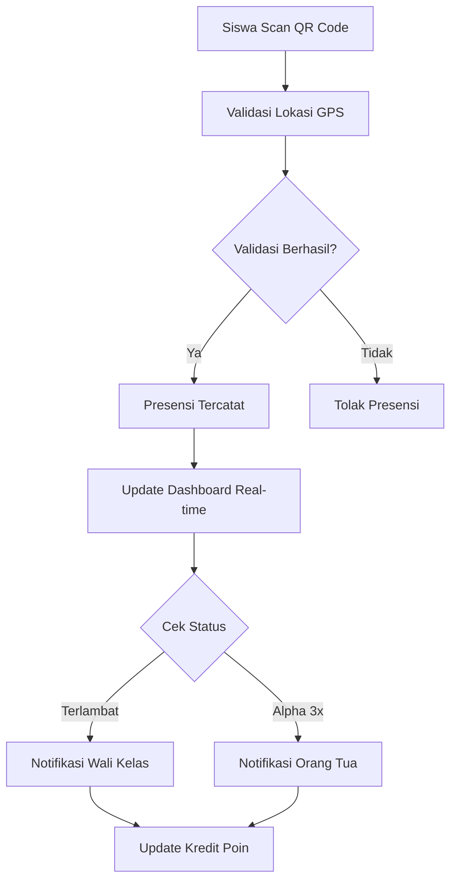
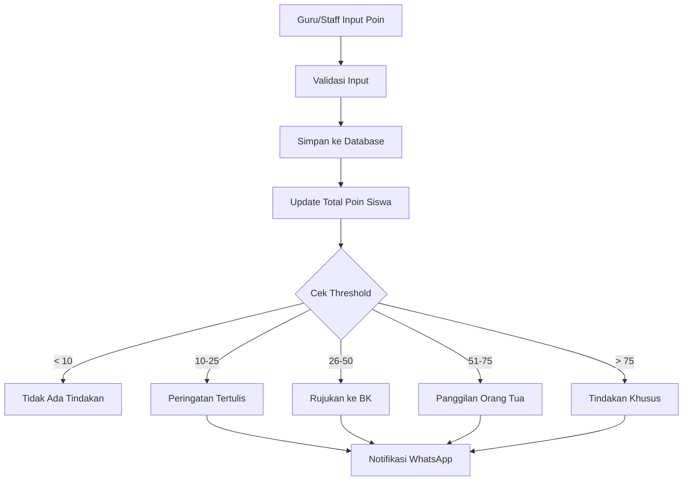
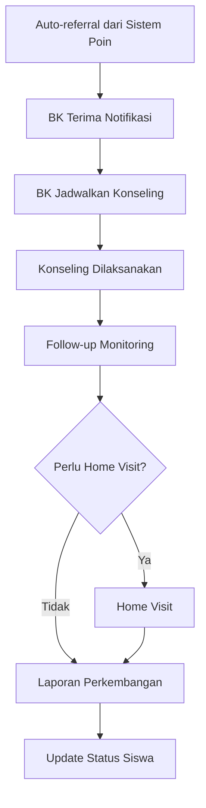

# RENCANA IMPLEMENTASI SISTEM MANAJEMEN KESISWAAN

## 🎉 **MAJOR PROGRESS UPDATE (REALITY CHECK)**

**STATUS**: PHASE 4 - CORE MODULES IMPLEMENTATION  
**OVERALL PROGRESS**: 25% COMPLETE (Foundation Only)  
**LAST UPDATED**: 19 September 2025

### **✅ COMPLETED PHASES (Partial):**
- ✅ **Phase 1**: Database & Core Models - PARTIAL (40% - Basic tables only)
- ✅ **Phase 2**: API Development & Authentication - PARTIAL (30% - Basic auth only)  
- ✅ **Phase 3**: Frontend Development & Dashboard - PARTIAL (30% - Basic structure only)

### **🚀 CURRENT PHASE:**
- 📋 **Phase 4**: Core Modules Implementation - IN PROGRESS (Foundation complete, core modules missing)

## 📋 **EXECUTIVE SUMMARY**

Sistem Manajemen Kesiswaan telah berhasil menyelesaikan **foundation layer** dengan database basic, authentication system, dan frontend structure. Namun, masih banyak **core modules** yang perlu diimplementasi untuk mencapai sistem yang lengkap dan fungsional.

### **⚠️ REALITY CHECK:**
- ✅ **Foundation**: Database basic (12/26+ tables), Auth, Frontend structure
- ❌ **Core Modules**: Presensi, Kredit Poin, BK, OSIS, Ekstrakurikuler (0% complete)
- ❌ **Business Logic**: Point system, notifications, reports (90% missing)
- ❌ **Integrations**: WhatsApp, file upload, advanced features (0% complete)

### **Keputusan Utama:**
- ✅ **Database Schema**: Rebuild dari awal
- ✅ **Dashboard**: Unified dengan role-based content
- ✅ **Business Logic**: Sesuai standar sekolah Indonesia
- ✅ **Notifikasi**: WhatsApp Business API
- ✅ **Technical**: Build new dengan modern stack

---

## 🗄️ **1. DATABASE SCHEMA REDESIGN**

### **1.1 Core System Tables**

```sql
-- Users & Authentication
CREATE TABLE users (
    id BIGINT PRIMARY KEY AUTO_INCREMENT,
    username VARCHAR(50) UNIQUE NOT NULL,
    email VARCHAR(100) UNIQUE NOT NULL,
    password VARCHAR(255) NOT NULL,
    role_type ENUM('admin', 'guru', 'siswa', 'tendik', 'bk', 'wali_kelas', 'osis', 'ekstrakurikuler', 'orang_tua') NOT NULL,
    status ENUM('aktif', '非aktif', 'suspended') DEFAULT 'aktif',
    email_verified_at TIMESTAMP NULL,
    two_factor_enabled BOOLEAN DEFAULT FALSE,
    created_at TIMESTAMP DEFAULT CURRENT_TIMESTAMP,
    updated_at TIMESTAMP DEFAULT CURRENT_TIMESTAMP ON UPDATE CURRENT_TIMESTAMP
);

CREATE TABLE roles (
    id BIGINT PRIMARY KEY AUTO_INCREMENT,
    name VARCHAR(50) UNIQUE NOT NULL,
    description TEXT,
    permissions JSON,
    level INT DEFAULT 0,
    created_at TIMESTAMP DEFAULT CURRENT_TIMESTAMP
);

CREATE TABLE user_roles (
    id BIGINT PRIMARY KEY AUTO_INCREMENT,
    user_id BIGINT NOT NULL,
    role_id BIGINT NOT NULL,
    assigned_at TIMESTAMP DEFAULT CURRENT_TIMESTAMP,
    assigned_by BIGINT NOT NULL,
    FOREIGN KEY (user_id) REFERENCES users(id) ON DELETE CASCADE,
    FOREIGN KEY (role_id) REFERENCES roles(id) ON DELETE CASCADE,
    FOREIGN KEY (assigned_by) REFERENCES users(id) ON DELETE CASCADE
);
```

### **1.2 User Management Tables**

```sql
-- Guru Management
CREATE TABLE guru (
    id BIGINT PRIMARY KEY AUTO_INCREMENT,
    user_id BIGINT NOT NULL,
    nip VARCHAR(20) UNIQUE NOT NULL,
    nama_lengkap VARCHAR(100) NOT NULL,
    bidang_keahlian VARCHAR(100),
    mata_pelajaran_id BIGINT,
    status_aktif BOOLEAN DEFAULT TRUE,
    created_at TIMESTAMP DEFAULT CURRENT_TIMESTAMP,
    updated_at TIMESTAMP DEFAULT CURRENT_TIMESTAMP ON UPDATE CURRENT_TIMESTAMP,
    FOREIGN KEY (user_id) REFERENCES users(id) ON DELETE CASCADE
);

-- Siswa Management
CREATE TABLE siswa (
    id BIGINT PRIMARY KEY AUTO_INCREMENT,
    user_id BIGINT NOT NULL,
    nis VARCHAR(20) UNIQUE NOT NULL,
    nama_lengkap VARCHAR(100) NOT NULL,
    kelas_id BIGINT,
    tahun_masuk YEAR,
    status_aktif BOOLEAN DEFAULT TRUE,
    created_at TIMESTAMP DEFAULT CURRENT_TIMESTAMP,
    updated_at TIMESTAMP DEFAULT CURRENT_TIMESTAMP ON UPDATE CURRENT_TIMESTAMP,
    FOREIGN KEY (user_id) REFERENCES users(id) ON DELETE CASCADE
);

-- Tendik Management
CREATE TABLE tendik (
    id BIGINT PRIMARY KEY AUTO_INCREMENT,
    user_id BIGINT NOT NULL,
    nip VARCHAR(20) UNIQUE NOT NULL,
    nama_lengkap VARCHAR(100) NOT NULL,
    unit_kerja VARCHAR(100),
    jabatan VARCHAR(100),
    status_aktif BOOLEAN DEFAULT TRUE,
    created_at TIMESTAMP DEFAULT CURRENT_TIMESTAMP,
    updated_at TIMESTAMP DEFAULT CURRENT_TIMESTAMP ON UPDATE CURRENT_TIMESTAMP,
    FOREIGN KEY (user_id) REFERENCES users(id) ON DELETE CASCADE
);
```

### **1.3 Kesiswaan Module Tables**

```sql
-- Program Kesiswaan
CREATE TABLE program_kesiswaan (
    id BIGINT PRIMARY KEY AUTO_INCREMENT,
    nama VARCHAR(100) NOT NULL,
    deskripsi TEXT,
    periode_mulai DATE,
    periode_selesai DATE,
    penanggung_jawab_id BIGINT,
    status ENUM('draft', 'aktif', 'selesai', 'dibatalkan') DEFAULT 'draft',
    created_at TIMESTAMP DEFAULT CURRENT_TIMESTAMP,
    updated_at TIMESTAMP DEFAULT CURRENT_TIMESTAMP ON UPDATE CURRENT_TIMESTAMP
);

-- Agenda Kesiswaan
CREATE TABLE agenda_kesiswaan (
    id BIGINT PRIMARY KEY AUTO_INCREMENT,
    program_id BIGINT NOT NULL,
    nama VARCHAR(100) NOT NULL,
    deskripsi TEXT,
    tanggal DATE NOT NULL,
    jam_mulai TIME,
    jam_selesai TIME,
    lokasi VARCHAR(100),
    status ENUM('draft', 'terjadwal', 'berlangsung', 'selesai', 'dibatalkan') DEFAULT 'draft',
    created_at TIMESTAMP DEFAULT CURRENT_TIMESTAMP,
    updated_at TIMESTAMP DEFAULT CURRENT_TIMESTAMP ON UPDATE CURRENT_TIMESTAMP,
    FOREIGN KEY (program_id) REFERENCES program_kesiswaan(id) ON DELETE CASCADE
);

-- Laporan Kesiswaan
CREATE TABLE laporan_kesiswaan (
    id BIGINT PRIMARY KEY AUTO_INCREMENT,
    program_id BIGINT,
    agenda_id BIGINT,
    jenis_laporan ENUM('harian', 'mingguan', 'bulanan', 'semester', 'tahunan') NOT NULL,
    konten TEXT NOT NULL,
    status ENUM('draft', 'submitted', 'approved', 'rejected') DEFAULT 'draft',
    created_by BIGINT NOT NULL,
    created_at TIMESTAMP DEFAULT CURRENT_TIMESTAMP,
    updated_at TIMESTAMP DEFAULT CURRENT_TIMESTAMP ON UPDATE CURRENT_TIMESTAMP,
    FOREIGN KEY (program_id) REFERENCES program_kesiswaan(id) ON DELETE CASCADE,
    FOREIGN KEY (agenda_id) REFERENCES agenda_kesiswaan(id) ON DELETE CASCADE,
    FOREIGN KEY (created_by) REFERENCES users(id) ON DELETE CASCADE
);
```

### **1.4 Presensi System Tables**

```sql
-- Presensi
CREATE TABLE presensi (
    id BIGINT PRIMARY KEY AUTO_INCREMENT,
    user_id BIGINT NOT NULL,
    tanggal DATE NOT NULL,
    jam_masuk TIME,
    jam_keluar TIME,
    status ENUM('hadir', 'terlambat', 'sakit', 'izin', 'alpha') DEFAULT 'alpha',
    lokasi_lat DECIMAL(10, 8),
    lokasi_lng DECIMAL(11, 8),
    qr_code VARCHAR(255),
    foto_absen VARCHAR(255),
    keterangan TEXT,
    divalidasi_oleh BIGINT,
    created_at TIMESTAMP DEFAULT CURRENT_TIMESTAMP,
    updated_at TIMESTAMP DEFAULT CURRENT_TIMESTAMP ON UPDATE CURRENT_TIMESTAMP,
    FOREIGN KEY (user_id) REFERENCES users(id) ON DELETE CASCADE,
    FOREIGN KEY (divalidasi_oleh) REFERENCES users(id) ON DELETE SET NULL
);

-- Jadwal Presensi
CREATE TABLE jadwal_presensi (
    id BIGINT PRIMARY KEY AUTO_INCREMENT,
    kelas_id BIGINT NOT NULL,
    hari ENUM('senin', 'selasa', 'rabu', 'kamis', 'jumat', 'sabtu') NOT NULL,
    jam_mulai TIME NOT NULL,
    jam_selesai TIME NOT NULL,
    mata_pelajaran_id BIGINT,
    guru_id BIGINT,
    created_at TIMESTAMP DEFAULT CURRENT_TIMESTAMP
);
```

### **1.5 Kredit Poin System Tables**

```sql
-- Kategori Kredit Poin
CREATE TABLE kategori_kredit_poin (
    id BIGINT PRIMARY KEY AUTO_INCREMENT,
    nama VARCHAR(100) NOT NULL,
    jenis ENUM('positif', 'negatif') NOT NULL,
    nilai_default INT NOT NULL,
    deskripsi TEXT,
    created_at TIMESTAMP DEFAULT CURRENT_TIMESTAMP
);

-- Kredit Poin
CREATE TABLE kredit_poin (
    id BIGINT PRIMARY KEY AUTO_INCREMENT,
    siswa_id BIGINT NOT NULL,
    kategori_id BIGINT NOT NULL,
    nilai INT NOT NULL,
    deskripsi TEXT NOT NULL,
    tanggal DATE NOT NULL,
    pelapor_id BIGINT NOT NULL,
    status ENUM('pending', 'approved', 'rejected') DEFAULT 'pending',
    created_at TIMESTAMP DEFAULT CURRENT_TIMESTAMP,
    updated_at TIMESTAMP DEFAULT CURRENT_TIMESTAMP ON UPDATE CURRENT_TIMESTAMP,
    FOREIGN KEY (siswa_id) REFERENCES siswa(id) ON DELETE CASCADE,
    FOREIGN KEY (kategori_id) REFERENCES kategori_kredit_poin(id) ON DELETE CASCADE,
    FOREIGN KEY (pelapor_id) REFERENCES users(id) ON DELETE CASCADE
);
```

### **1.6 Notification System Tables**

```sql
-- Notifikasi
CREATE TABLE notifikasi (
    id BIGINT PRIMARY KEY AUTO_INCREMENT,
    user_id BIGINT NOT NULL,
    jenis ENUM('info', 'warning', 'success', 'error') NOT NULL,
    judul VARCHAR(255) NOT NULL,
    pesan TEXT NOT NULL,
    status_baca BOOLEAN DEFAULT FALSE,
    tanggal_kirim TIMESTAMP DEFAULT CURRENT_TIMESTAMP,
    data_terkait JSON,
    FOREIGN KEY (user_id) REFERENCES users(id) ON DELETE CASCADE
);

-- WhatsApp Logs
CREATE TABLE whatsapp_logs (
    id BIGINT PRIMARY KEY AUTO_INCREMENT,
    user_id BIGINT NOT NULL,
    nomor_wa VARCHAR(20) NOT NULL,
    pesan TEXT NOT NULL,
    template VARCHAR(100),
    status ENUM('pending', 'sent', 'delivered', 'failed') DEFAULT 'pending',
    tanggal_kirim TIMESTAMP DEFAULT CURRENT_TIMESTAMP,
    response_data JSON,
    FOREIGN KEY (user_id) REFERENCES users(id) ON DELETE CASCADE
);
```

---

## 🎨 **2. DASHBOARD ARCHITECTURE**

### **2.1 Unified Dashboard Strategy**

**Hybrid Approach**: Single codebase dengan role-based content rendering

### **2.2 Dashboard Structure**

```
src/
├── components/
│   ├── dashboard/
│   │   ├── DashboardLayout.vue
│   │   ├── RoleBasedSidebar.vue
│   │   ├── RoleBasedContent.vue
│   │   └── widgets/
│   │       ├── SiswaWidgets.vue
│   │       ├── GuruWidgets.vue
│   │       ├── WaliKelasWidgets.vue
│   │       ├── BKWidgets.vue
│   │       ├── OSISWidgets.vue
│   │       └── EkstrakurikulerWidgets.vue
│   └── ui/
│       ├── Layout.vue
│       ├── Navigation.vue
│       └── Sidebar.vue
├── views/
│   ├── Dashboard/
│   │   ├── DashboardView.vue
│   │   ├── SiswaDashboard.vue
│   │   ├── GuruDashboard.vue
│   │   ├── WaliKelasDashboard.vue
│   │   ├── BKDashboard.vue
│   │   ├── OSISDashboard.vue
│   │   └── EkstrakurikulerDashboard.vue
└── stores/
    ├── dashboardStore.js
    └── roleStore.js
```

### **2.3 Role-Based Configuration**

```javascript
const roleDashboardConfig = {
  siswa: {
    widgets: ['presensi', 'kredit_poin', 'jadwal', 'notifikasi'],
    menu: ['presensi', 'kredit_poin', 'jadwal', 'profil'],
    permissions: ['read_own_data', 'view_schedule'],
    dashboard: 'SiswaDashboard'
  },
  guru: {
    widgets: ['kelas_ampu', 'presensi_siswa', 'input_poin', 'jadwal'],
    menu: ['kelas', 'presensi', 'kredit_poin', 'jadwal'],
    permissions: ['manage_class', 'input_points', 'view_schedule'],
    dashboard: 'GuruDashboard'
  },
  wali_kelas: {
    widgets: ['kelas_ampu', 'presensi_kelas', 'kredit_poin_kelas', 'koordinasi_bk'],
    menu: ['kelas', 'presensi', 'kredit_poin', 'koordinasi_bk'],
    permissions: ['manage_class', 'view_class_data', 'coordinate_bk'],
    dashboard: 'WaliKelasDashboard'
  },
  bk: {
    widgets: ['siswa_rujukan', 'jadwal_konseling', 'home_visit', 'laporan'],
    menu: ['konseling', 'home_visit', 'laporan', 'siswa'],
    permissions: ['manage_counseling', 'home_visit', 'view_reports'],
    dashboard: 'BKDashboard'
  },
  osis: {
    widgets: ['struktur_osis', 'kegiatan', 'anggota', 'laporan'],
    menu: ['struktur', 'kegiatan', 'anggota', 'laporan'],
    permissions: ['manage_osis', 'view_activities', 'manage_members'],
    dashboard: 'OSISDashboard'
  },
  ekstrakurikuler: {
    widgets: ['daftar_ekskul', 'anggota', 'jadwal', 'prestasi'],
    menu: ['ekskul', 'anggota', 'jadwal', 'prestasi'],
    permissions: ['manage_extracurricular', 'view_members', 'manage_schedule'],
    dashboard: 'EkstrakurikulerDashboard'
  }
}
```

---

## 🔄 **3. BUSINESS LOGIC FLOWS**

### **3.1 Presensi Flow**



### **3.2 Kredit Poin Flow**



### **3.3 Bimbingan Konseling Flow**



---

## 📱 **4. NOTIFICATION SYSTEM**

### **4.1 WhatsApp Integration**

```javascript
class WhatsAppService {
  async sendMessage(phoneNumber, message, template = null) {
    try {
      const response = await this.whatsappAPI.send({
        to: phoneNumber,
        message: message,
        template: template
      });
      
      await this.logNotification('whatsapp', phoneNumber, message, 'sent');
      return response;
    } catch (error) {
      await this.fallbackNotification(phoneNumber, message);
      throw error;
    }
  }
}
```

### **4.2 Notification Templates**

```javascript
const notificationTemplates = {
  presensi_terlambat: {
    template: 'presensi_terlambat',
    message: 'Halo {nama_ortu}, {nama_siswa} terlambat masuk sekolah pada {tanggal} pukul {jam}. Mohon perhatiannya.'
  },
  presensi_alpha: {
    template: 'presensi_alpha',
    message: 'Halo {nama_ortu}, {nama_siswa} tidak hadir di sekolah pada {tanggal}. Mohon konfirmasi kehadiran.'
  },
  kredit_poin_rujukan_bk: {
    template: 'rujukan_bk',
    message: 'Halo {nama_ortu}, {nama_siswa} dirujuk ke BK karena kredit poin mencapai {total_poin}. Mohon koordinasi dengan sekolah.'
  }
}
```

---

## 🛠️ **5. TECHNICAL IMPLEMENTATION**

### **5.1 Backend Architecture**

```
app/
├── Http/
│   ├── Controllers/
│   │   ├── Api/
│   │   │   ├── DashboardController.php
│   │   │   ├── PresensiController.php
│   │   │   ├── KreditPoinController.php
│   │   │   └── NotificationController.php
│   │   └── Web/
│   ├── Middleware/
│   │   ├── RoleMiddleware.php
│   │   └── PermissionMiddleware.php
│   └── Requests/
├── Services/
│   ├── DashboardService.php
│   ├── PresensiService.php
│   ├── KreditPoinService.php
│   ├── NotificationService.php
│   └── WhatsAppService.php
├── Models/
├── Repositories/
└── Events/
```

### **5.2 Frontend Architecture**

```
src/
├── components/
│   ├── ui/
│   ├── dashboard/
│   ├── presensi/
│   ├── kredit-poin/
│   └── notification/
├── views/
│   ├── Dashboard/
│   ├── Presensi/
│   ├── KreditPoin/
│   └── Notification/
├── stores/
│   ├── dashboard.js
│   ├── presensi.js
│   ├── kreditPoin.js
│   └── notification.js
├── services/
│   ├── api.js
│   ├── dashboard.js
│   ├── presensi.js
│   └── notification.js
└── utils/
    ├── role.js
    ├── permission.js
    └── notification.js
```

---

## 📈 **6. ADDITIONAL RECOMMENDATIONS**

### **6.1 Performance Optimization**
- **Redis Caching** untuk dashboard data
- **Lazy Loading** untuk komponen dashboard
- **API Pagination** untuk data besar
- **Image Optimization** untuk foto presensi

### **6.2 Security Enhancement**
- **JWT Token** dengan refresh mechanism
- **Rate Limiting** untuk API endpoints
- **Input Validation** yang ketat
- **SQL Injection** protection

### **6.3 Monitoring & Analytics**
- **Error Tracking** dengan Sentry
- **Performance Monitoring** dengan New Relic
- **User Analytics** dengan Google Analytics
- **Database Monitoring** dengan Laravel Telescope

### **6.4 Testing Strategy**
- **Unit Tests** untuk business logic
- **Integration Tests** untuk API endpoints
- **E2E Tests** untuk user workflows
- **Performance Tests** untuk load testing

### **6.5 Deployment Strategy**
- **Docker Containerization**
- **CI/CD Pipeline** dengan GitHub Actions
- **Environment Management** (dev, staging, prod)
- **Database Migration** strategy

---

**Dokumen ini akan dilanjutkan dengan bagian Project Timeline dan Implementation Checklist di bagian berikutnya...**
